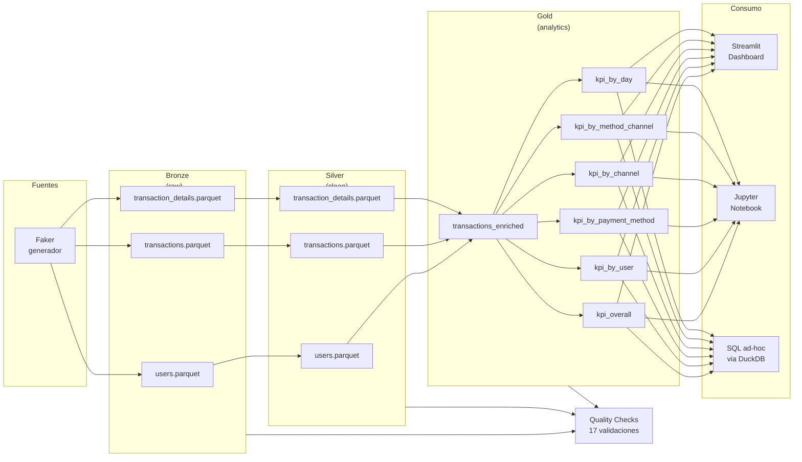

# Arquitectura del Pipeline

## Diagrama de flujo

## Decisiones técnicas

### ¿Por qué Medallion (Bronze / Silver / Gold)?
- **Trazabilidad**: si un KPI sale raro, podemos retroceder y ver el dato crudo.
- **Idempotencia**: regenerar Silver no reingiere datos — partimos siempre de Bronze.
- **Separación de responsabilidades**: cada capa tiene un único propósito.

### ¿Por qué DuckDB en vez de PostgreSQL?
- **Cero infraestructura**: corre en proceso, no necesita servidor.
- **Lee parquet directamente** con SQL — no hay que cargar nada antes.
- **Performance analítico**: motor columnar, ~10–100x más rápido que SQLite para agregaciones.
- **Para producción** se reemplaza fácilmente por Snowflake / BigQuery / Redshift sin tocar SQL.

### ¿Por qué Parquet en vez de CSV?
- **Tipado**: las fechas son fechas, los floats son floats.
- **Comprimido**: ~5–10x más pequeño que CSV.
- **Columnar**: lee solo las columnas que necesitas → analytics rápido.

### Trazabilidad
Cada capa añade columnas técnicas:
- Bronze: `_ingested_at`, `_pipeline_run_id`, `_source_file`
- Silver: hereda las anteriores + `_silver_processed_at`

Esto permite auditar de qué corrida del pipeline vino cada fila.

## Niveles de la rúbrica cubiertos

| Nivel | Estado | Implementación |
|---|---|---|
| 0 — Ingesta | ✅ | `src/ingestion/generate_data.py` + `src/bronze/load_bronze.py` con env vars |
| 1 — Silver | ✅ | `src/silver/transform.py` aplica todas las reglas de negocio del PDF |
| 2 — Gold | ✅ | 7 SQL files en `sql/` + `src/gold/build_kpis.py` orquestador |
| 3 — Calidad | ✅ | 17 validaciones en `src/quality/validations.py`, logging con archivo + stdout |
| 4 — Arquitectura | 🟡 | Orquestación con `main.py`, código modular, env vars, run_id por corrida. Falta: particionamiento por fecha + incremental |
| 5 — Insights | ✅ | Dashboard Streamlit + 3 insights en `docs/resumen_ejecutivo.md` + notebook |

## Próximos pasos (mejoras posibles)

- **Particionamiento por fecha** en Bronze/Silver (`year=2025/month=01/...`) para incremental.
- **Incremental loads**: detectar máximo `_ingested_at` y solo procesar lo nuevo.
- **Orquestación con Prefect/Airflow** en lugar del runner manual.
- **Great Expectations** para reemplazar las validaciones manuales con expectativas declarativas.
- **Streaming**: si los datos llegan en tiempo real, ingerir con Kafka + Spark Structured Streaming.
