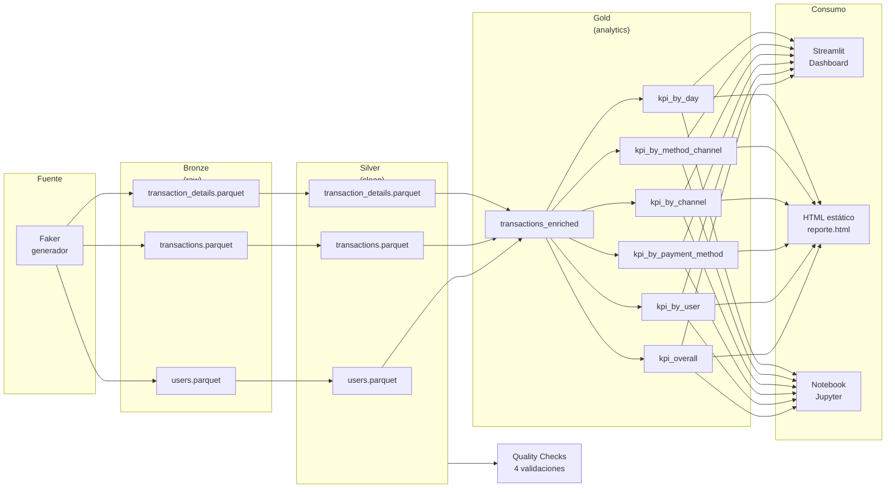

# Arquitectura del Pipeline

## Diagrama de flujo

Todo el pipeline vive en un solo archivo: [`pipeline.py`](../pipeline.py),
con cinco funciones que reflejan las cinco etapas:
`generar_datos()` → `cargar_bronze()` → `construir_silver()` → `construir_gold()` → `validar()`.

### ¿Por qué dos versiones del dashboard?
- **Streamlit** (`dashboard/app.py`): interactivo, profesional, requiere correr un servidor.
- **HTML estático** (`docs/reporte.html`): un solo archivo, doble-click y listo. Ideal
  para compartir como adjunto o cuando no se puede correr Python.

